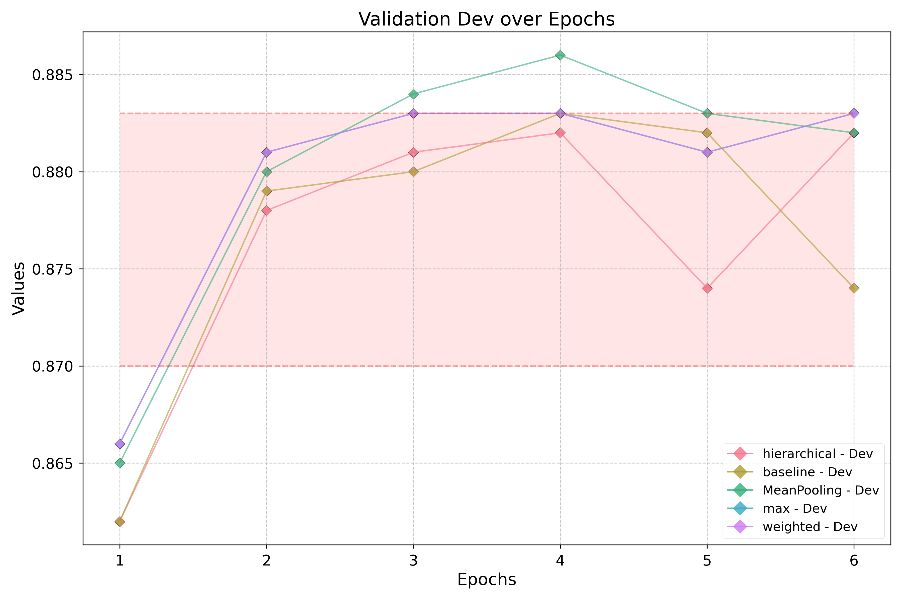
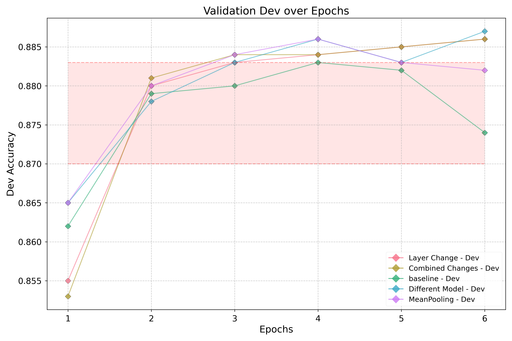
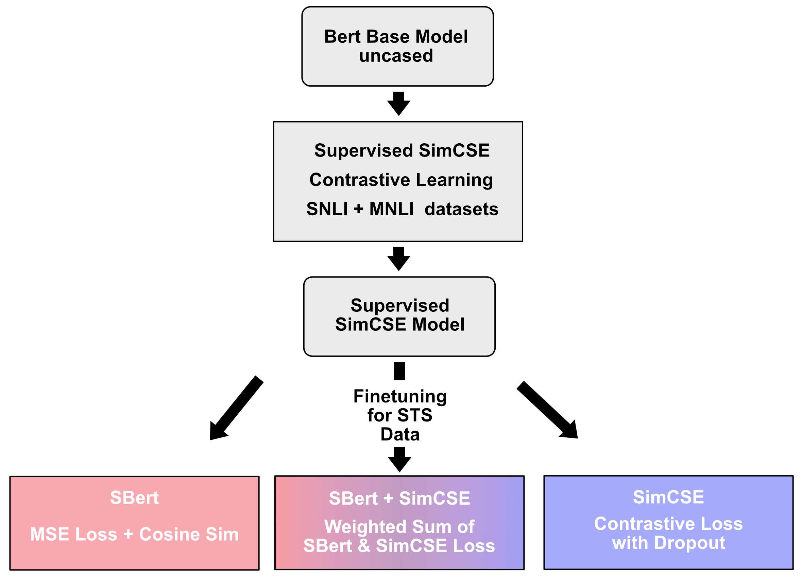
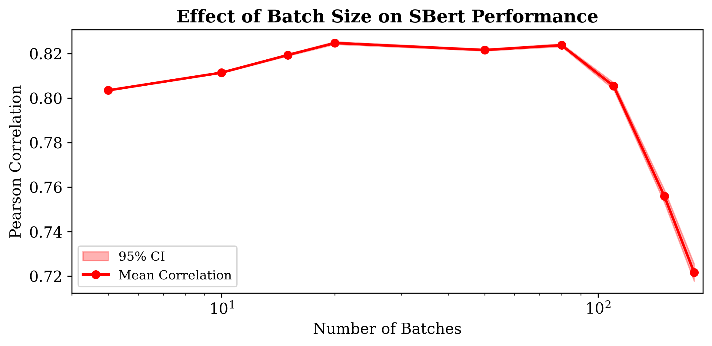
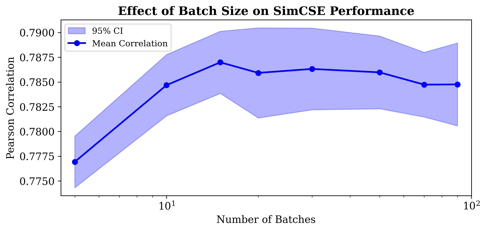
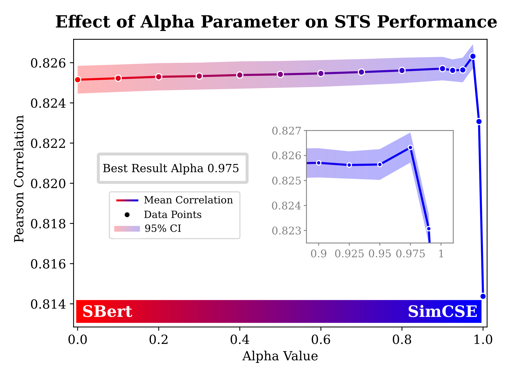
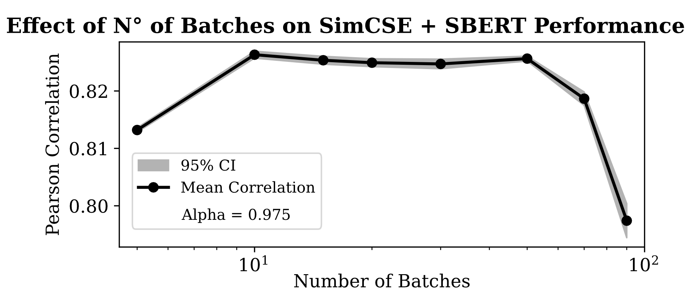
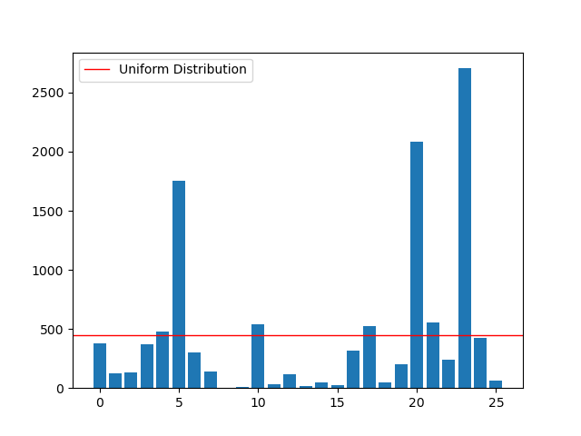

# DNLP SS25 Final Project 

<h3>Group Name: NiceLovablePeople</h3>

Group code: G04

Group repository:

Tutor responsible: Niklas Bauer

Group team leader: Esther Hagenkort: esthako/GOESTERN-1006113 

Group members:
- Georg Eckardt: qub3s
- Hamza Ahmed Siddiqui: hamzasiddiqui10
- Amon Pönitzsch: 4m0n
- Leonardo Christian da Camara Silva: Dacasil


## Introduction
This repository is our implementation of the project for the model M.Inf.2202: Deep Learning for Natural Language Processing at the University of Göttingen by the GippLab.

Adsitionally to completing the bert implementation and the optimizer, the following tasks have been completed:
- Stanford Sentiment Treebank (SST) - Sentiment analysis
- Quora Question Pairs (QQP) - Question similarity
- Semantic Textual Similarity (STS) - Measuring text meaning similarity
- Paraphrase Type Detection (PTD) - Identifying paraphrase types and relationships
- Paraphrase Type Generation (PTG) - Generating diverse paraphrase types
- Bonus: Paraphrase Type Detection with Bert (PTD-Bert) - Identifying paraphrase types and relationships

## Contributions
We followed the instructions and adapted hyperparameters when needed to avoid overfitting.

Esther Hagenkort: 
- bert.py (revise, comment)
- bonus: paraphrase type detection with bert (PTD-bert) (debugging)
- Paraphrase Type Generation (PTG)

Georg Eckardt: 
- optimizer
- bert.py
- Paraphrase Type Detection - PTD

Hamza Ahmed Siddiqui:
- Came up with group name 
- bert.py (revise, comment)
- Stanford Sentiment Treebank (SST) - Sentiment analysis

Amon Pönitzsch:
- paraphrase detection (QQP)
- Pretrain SimCSE on NLI datasets (Support)

Leonardo Christian da Camara Silva:
- Semantic Textual Similarity (STS)
- Pretrain SimCSE on NLI datasets (Lead)
- bonus: Paraphrase type detection with bert (PTD-bert)

## Methodology


## Experiments and Results

### Stanford Sentiment Treebank (SST) - Sentiment Analysis
The vanilla implementation of the sentiment prediction with minBERT gave us a baseline of 0.521 dev accuracy in Part-01. 

To improve the model, a myriad of research questions were posited and then worked on. The main target to measure model's performance was dev set accuracy after each experiment. Some experiments yielded increases in the dev accuracy, some did not affect the accuracy although they were sensible, and some worsened the dev accuracy. In this section, all of the major improvement attempts are explained in order and at the end you will find a summary table which will show you dev accuracy after each change was implemented.

The state-of-the-art model for the SST dataset has ~59.8% dev accuracy so room for improvement from baseline is slim. And even 0.5% improvements in accuracy are significant for this problem.

<h3> 1. Is attention masking in the the self-attention layer for a sentiment classification task hurting performance? </h3>
<details> 

**Explanation:** In our Part-01 submission we had to complete bert.py according to documentation so we had implemented the attention masking so subsequently the model only has left-context. For a sentiment classification task, bi-directional context will always be available and will always be more powerful so my expectation is a slight improvement in dev accuracy.

**Implementation:** Code change was straightforward whereby I had to comment out the attention-masking in `bert.py`. 
```
X = X + attention_mask ## HS: attention mask removed for bidirectional context
```
The results did not improve and my understanding is that the model needed to be pretrained with bi-directional context properly for this alteration to impact results significantly. Since we are only finetuning the model the impact on results is negligible.

</details>


<h3>2. Can we solve the clear overfitting problem in the baseline model?</h3>
<details> 

**Explanation:** In baseline model’s training, the training accuracy increases consistently and reaches 90%+ whereas dev accuracy plateaued around 52% and even starts going down in later epochs. This shows directly that the baseline model is suffering from overfitting on the training data. The solution can be some hyperparameter tuning.

**Implementation:** 
- L2 regularization: in the baseline implementation we did not have any regularization so the weights could grow indefinitely. After looking at documentation for AdamW, I found that the weight_decay parameter can enable L2 regularization. I tried 0.01 and 0.025 and settled on the latter. 

- Learning Rate: a default learning rate of 1e-5 almost always lead to quick convergence of training accuracy to 90%+ values. I experimented with lower values and found that 1e-6 is the ideal value as the dev accuracy increases gradually and while keeping the train accuracy under control so the model will generalize much better. 

The expectation was that with L2 regularization and the smaller learning rate, the model will converge slowly so I had to increase the epochs from 10 to 25. 

**Results:** The results showed clearly that the train accuracy was now more in tandem with the dev accuracy but there was no discernible improvement in the baseline dev accruacy. These changes made training models more much more expensive but it is worth it because the models will now generalize much better. (Note: Although solving overfitting is a positive change, I reverted to original (lr=1e-5 / epochs=10) settings for the remainder of my experiments for quicker trainings and validations). 

Additional idea that was not implemented: Introduce an early-stopping mechanism wherein the training stops if improvement in the dev accuracy in an epoch relative to 3 previous epochs is below a threshold. But training for this problem with baseline hyperparameters was fairly quick so this idea was not pursued further.

</details> 

<h3>3. Can document-level sentiment scores from a lexical database aid minBERT in sentiment classification?</h3>

<details> 

**Explanation:** This work is inspired by the feature fusion approach of Hoover et al. (2020), but I will implement a simplified, document-level variant. Instead of performing complex phrase-level composition, we calculate aggregate SentiWordNet scores for the entire input sentence and concatenate them directly with the h_cls embedding before classification. This provides the model with a strong prior sentiment signal without additional computational overhead.

The baseline model uses the final 768-d CLS token’s hidden state to predict sentiment of a movie review. The idea was whether we can enrich this input to the classification head by using a lexical resource like WordNet wherein alongside the 768 features of the CLS token which encode “sentence sentiment through self-attention mechanism”, we also get some sentiment scores to the classification head.

I used SentiWordNet (SWN) which assigns sentiment scores to WordNet synsets. Each synset has three SWN scores:
- Positive score (0.0 to 1.0)
- Negative score (0.0 to 1.0)
- Objective score (0.0 to 1.0) The objective score tells us how neutral or factual a word is. A higher score means the word carries less emotional sentiment.

The 3 scores always sum to 1.0 for each synset.

These scores enrich the input space by telling the model the overall positivity or negativity of a sentence through a statistical approach. Keep in mind these scores completely ignore context and are word level features aggregated down to document-level. (Note: I used averaging for aggregation over summing because the latter would have given much more weight to longer sentences.)

I initially used only positive and negative scores in my experiment. Adding objective score to the feature space reduced the dev accuracy slightly so ultimately decided to not use the objective score. It is unclear what the problem was because multi collinearity is not a problem for deep learning that is why usually more features are better and the network learns to ignore useless features. But the objective score feature was adding some noise to the model hurting accuracy so it was removed.

Paper: SentiBERT: A Transferable Transformer-Based Architecture for Compositional Sentiment Semantics
https://aclanthology.org/2020.acl-main.341.pdf


**Implementation:** To implement this I had to break down the problem in multiple sub-problems which were solved as follows:

1. Analyzed `datasets.py` to find how to access the raw 'sentence' column of csv for each batch of the dataloader easily. Found that we can use `batch['sents']`. This is crucial because I wanted to develop a system wherein I can get SWN scores for any seen/unseen datasets.

2. Wrote `sentiwordnet_processor.py` module which downloads NLTK dependencies and the `SentiWordNetProcessor` class which takes in a sentence, calculates scores for each word in the sentence and aggregates the scores to get sentence-level positive score and negative score. Lemmatization before scoring was added to enable score calculation for more words per sentence. Most Frequent Sense (MFS) synset was used for every word to get the sentiment scores.

3. Altered the `predict_sentiment()` function of `MultitaskBERT` class so it can calculate SWM’s avg_pos_score and avg_neg_score and then append them in the CLS token’s vector before the classification head.

4. Slight changes in the training loop to make sure that the raw sentences are being accessed for each batch and passed into the `predict_sentiment()` function. (`evaluation.py` changes same as training loop)

5. Installing NLTK on cluster: `setup_gwdg_nltk.sh`

The expectation was that this ensemble approach containing both BERT and SentiWordNet information for predicting sentiment will have a significant improvement in dev accuracy.

**Results:** Dev accuracy improved to 0.532 and became more stable during fine tuning so this met my expectations and turned out to be a very good change.

</details> 

<h3>4. Does the classification head architecture require complexity?</h3>

<details> 

**Explanation:** The CLS token is mapped onto the classification head directly after concatenation of SWN scores. I thought maybe adding some layers in between will help learn even more complex relationships between 768 features from BERT and the additional SWN scores.

**Implementation:** I tried two different architectures to go from 770 features to 5 classes in the last layer:
- (768+2) → 128 → 16 → 5
- (768+2) → 64 → 5

**Results:** Both architectures performed poorly by reducing dev accuracy to around 0.49 so reverted back to simple 770 → 5 architecture.

<h3>5. Can we engineer new features from the SentiWordNet positive and negative scores to improve classification?</h3>

**Explanation:** Engineer 3 new features from pos_score and neg_score (strength, ratio, net)

**Implementation:**
- sentiment_strength = avg_pos_score + avg_neg_score  # How strong the sentiment is
- sentiment_ratio = avg_pos_score / (avg_neg_score + 1e-8) if avg_neg_score > 0 else 10  # Pos/Neg ratio
- net_sentiment = avg_pos_score - avg_neg_score  # Net sentiment score

My expectations were this will result in slight improvement, not major because the information captured inside the raw pos_score and neg_score was already represented, these new features merely describe some interactions between the raw features. But my previous attempt at capturing said interactions between raw features i.e. experiment #4 failed so I was skeptical.

**Results:** Dev accuracy stayed very similar with no noteworthy increase but I still believe this is a reasonable addition to keep in future models. Intuitively these are good features and enrich the raw SWN feature space.

</details> 

<h3>6. Is the SentiWordNetProcessor performing similarly on all classes?</h3>

<details> 

**Explanation:** Error analysis revealed a significant performance disparity, with poorer accuracy on negative reviews (classes 0-1) compared to positive ones (classes 3-4). We hypothesized that this was due to the prevalence of negated positive statements (e.g., 'this movie is "not good"') in negative reviews, which our initial SentiWordNet processor misinterpreted as positive. To address this, we implemented a negation handling module inspired by the classic technique of Turney (2002). This module flips the positive and negative sentiment scores of a word if it is preceded by a negation term (e.g., 'not', 'no', 'never'), thereby correctly interpreting phrases like 'not good' as negative.

Paper: Thumbs Up or Thumbs Down? Semantic Orientation Applied to Unsupervised Classification of Reviews 
https://aclanthology.org/P02-1053.pdf 

**Implementation:** “Negation handling” functionality was added to the swn processor and wrote a new class `SentiWordNetProcessor_NegHandling` which flips positive and negative scores of a word if the word is preceded by a negating word like “no”, “not”, “barely” etc. To determine if a given word is negated, I looked back 3 words in the text for a negating word.

My experimentation showed that negating (flipping) only on positive scores yielded slightly better results so in the finalized version I am only doing negation handling for words deemed as positive by SWN.

Error analysis also allowed me to look at the problem with more granularity and I realized some domain-specific intervention in the wordnet sentiment scores is required for the lexical database to perform better on the specific domain of movie reviews. I asked DeepSeek (AI) to give me:
- List of common positive sentiment words list in movie reviews
- List of common negative sentiment words list in movie reviews

These lists of words did not come from the SST data so there is no risk of introducing bias in the model. After close analysis of SWN scores of these words, I found some words (37 negative and 16 positive) whose SWN scores I did not agree with. An over-ride mechanism was implemented in the processor for these words. Lists of these words can be found in the `SentiWordNetProcessor_NegHandling` class' __init__. Effectively, I am using a customized version of SentiWordNet for the SST task from hereon.

I was expecting the model to perform similarly on the positive reviews and improve on the negativ examples because of negation handling mainly. And a small improvement was also expected overall due to the domain-specific intervention.

**Results:** Major improvement in dev accuracy observed after this new swn processor was implemented. Dev accuracy climbed up to 0.540. 

</details> 

<h3>7. Should we trust the minBERT model or the SWN scores equally?</h3>

<details> 

**Explanation:** The model has two distinct components that it uses to predict sentiment of a sentence:
1. min BERT h_cls token’s 768 features
2. SWN’s 5 features (2 raw + 3 engineered)

The weight of these two sources is equal at the moment but in reality one source must be better or worse than the other. How much do I trust each source is the million dollar question. My idea is to use a learned gating system to let the model dynamically decide how much to trust SWN vs BERT features for sentiment classification.

**Implementation:** Instead of just concatenating SWN scores to h_cls, I introduced a simple learned gating system to let the model dynamically decide how much to trust SWN vs BERT features for each example.

It's a simple NN which takes in (h_cls + SWN) scores and outputs two weights (0.0 < weight < 1.0) using a sigmoid function. First weight for BERT features and second weight for the SWN scores.

Gating mechanism Architecture: (768+5) → 256 → 2

The bert_weight is multiplied element-wise to 768 BERT features, and the swn_weight is multiplied element-wise to the 5 SWN features before all are concatenated and mapped to the classification head.

Lastly, instead of a sigmoid function, a softmax was also tried to make the two weights sum up to 1.0 such that the two components, BERT and SWN, compete with each other for final prediction. But it reduced dev accuracy slightly so sigmoid was chosen ultimately. The sigmoid gives a 0-1 weight for each of BERT and SWN independent of each other.

My expectation from this change was a significant improvement in accuracy because now the model will weigh the two types of informations correctly instead of plain 50-50.

**Results:** Slight improvement in dev accuracy was observed but nothing dramatic.

</details> 

<h3>8. Can we add one more lexical database’s sentiment scores in addition to SWN scores to see if it improves the model?</h3>

<details> 

**Explanation:** The Valence Aware Dictionary and sEntiment Reasoner (VADER) scores are a document-level (sentence-level) polarity scores which describe positivity or negativity in sentiment of a text. There are 4 components returned by polarity_scores():

- pos: Positive sentiment proportion (0.0 to 1.0)
- neg: Negative sentiment proportion (0.0 to 1.0)
- neu: Neutral sentiment proportion (0.0 to 1.0): How much of the text is neutral/factual.
- compound: Overall sentiment score (-1.0 to +1.0)

Note: pos + neg + neu = 1.0 like the SWN scores

Paper: https://www.researchgate.net/publication/381650914_Understanding_Sentiment_Analysis_with_VADER_A_Comprehensive_Overview_and_Application

**Implementation:** Implementation was a much simpler activity because all the skeleton for the use of SWN scores was already set up and extracting VADER scores for each sentence was a trivial task. A new `VADERProcessor` class was written to extract these scores. The "neutral" vader score was not used due to same reason avg_obj_score from SWN was ommitted. Additionally, the gating mechanism was altered to cater to this novel, third type of features in addition to BERT and SWN. 

- OLD Gating mechanism Architecture: (768+5) → 256 → 2
- NEW Gating mechanism Architecture: (768+5+3) → 256 → 3

**Results:** As expected, the VADER scores enriched the model further with more information about sentiment from a new source so the dev accuracy rose to 0.544 which turned out to be the highest achieved in all the experiments.

</details> 

<h3>9. Adding more training data</h3>

<details> 

**Explanation:** Increasing training data would definitely help the model's performance so I tried to find open-source, fine-grained sentiment movie review datasets on the internet but was unsuccessful. The closest usable thing I found was the binary sentiment IMDB movie review dataset on kaggle https://www.kaggle.com/datasets/lakshmi25npathi/imdb-dataset-of-50k-movie-reviews with 50000 examples. 

**Implementation:** I changed the sentiments from positive and negative to 4 and 0 respectively, changed the column names, appended the dataset to my training data. The simple data manipulation and saving can be seen in the `./data_extra/data_wrangling.ipynb`. I was not expecting good results because:
- The sentiments in the new data were not fine-grained which made the extra IMDB data different from my problem at hand which had 5 sentiments.
- Not all examples were usable for me because the average movie-review length was much bigger in the IMDB dataset which was causing out-of-memory errors during training so I was able to use only 1856 rows from the IMDB data for my training.

**Results:** At the end, after appending the extra data in training set the dev accuracy dropped to 0.503 so I reverted to my original training data. I did not add this section in the summary at the end because this was the last experiment and turned out unsuccessful.

</details> 

<h3>Summary of Experiments:</h3>

| Sno.| Experiment | Best Dev Accuracy |
|---|--------------|-------------------|
| 0 | Baseline | 0.521 |
| 1 | Remove attention masking from BERT | 0.520 |
| 2 | Hyperparameter tuning to solve overfitting | 0.519 (reverted) |
| 3 | SWN score (positive and negative) added to h_cls | 0.532 |
| 4 | Add dense layers between h_cls and classification head| 0.490 (reverted) |
| 5 | Engineer 3 new features from SWN positive and negative scores| 0.533 |
| 6 | Negation Handling and domain-specific knowledge added to SWN processor | 0.540 |
| 7 | Gating mechanism added to weight BERT model and SWN scores | 0.542 |
| 8 | VADER scores (positive, negative, compound) added to h_cls | 0.544 |

**Hyperparameters used for final model:**
- mode: `finetune`
- epochs: `10`
- learning rate: `1e-05`
- optimizer: `AdamW`
- dropout rate: `0.20`
- batch size: `64`

Note: The final model reaches peak dev accuracy of 0.544 in the 3rd epoch and saves itself. Beyond the 3rd epoch it just overfits to training data as highlighted in the experiment #2.


### Quora Question Pairs (QQP) - Question similarity

  

To continue with the Quora Question Pairs (QQP) project, my main goal was to surpass the initial baseline development accuracy of 0.870. For this part i made a few specific adjustments to the hyperparameters. The execution time for 6 epochs consistently remained at around 77 minutes (±1 min) across all runs, so this metric will not be a focus for further analysis.

  

I decided to increase the number of epochs to 6 and reduce the learning rate to 1e-5. The Hyperparamer-fine-tuned model achieved a new peak dev accuracy of `0.883`. Although this wasn't the final, comprehensive set of changes, I decided to establish this as my new, personal baseline for the project. My next step will be to implement more significant modifications to try and improve on this new benchmark.

  

<h3>1. Multi-layer Perceptron Classifier for Paraphrase Detection</h3>

<details>

  

**Explanation:**

The original model used a single linear layer to classify paraphrases, which is a simple approach. The improved version replaces this with a **multi-layered classifier** to learn more complex patterns. This change is based on the principle that a deeper network can capture more nuanced relationships between the sentence embeddings, leading to better performance. The addition of a **GELU activation function** and an extra dropout layer brings non-linearity and helps prevent overfitting.


**Implementation:**

  
The single `nn.Linear` layer for the `paraphrase_classifier` was replaced with a `nn.Sequential` block. This new architecture consists of two linear layers, a GELU activation, and a dropout layer. The first linear layer transforms the concatenated BERT embeddings (`BERT_HIDDEN_SIZE`) into a hidden size of 768, while the second layer outputs the final logit. To ensure stable training, the weights of both linear layers were initialized using **Xavier uniform initialization**, and their biases were set to zero.

  

**Results**

  

The implementation of the new classifier resulted in a modest improvement in performance, with the accuracy increasing from 0.870 to 0.886.

</details>

<h3>2. Bi-Encoder Approach</h3>

<details>

  

**Explanation:**

  

The previous model's approach to paraphrase detection was limited. It concatenated the input sentences and processed them as a single sequence, relying on the BERT model to create a single, combined embedding. This method may not be optimal for capturing the individual nuances of each sentence and their relationship.

  

The new implementation improves on this by treating the sentences separately. By generating individual embeddings for each sentence (u and v), the model can explicitly compare them. The core of this improvement is the **S.I.A.M.E.S.E. (Sentence-pair similarity)** approach, which uses three distinct features for classification:

  

1. The embedding of the first sentence (u).

2. The embedding of the second sentence (v).

3. The absolute difference between the two embeddings (∣u−v∣).

  

This triplet of features allows the model to learn a better representation of the relationship between the sentences. It gives the model a more explicit signal about the magnitude of the differences between the two sentence vectors, which is a powerful indicator of their semantic similarity. This approach should lead to a better and more accurate model for paraphrase detection.

  

**Implementation:**

  

The `predict_paraphrase` function was modified to first get the individual embeddings for each sentence, `u` and `v`, by calling `self.forward` on `input_ids_1` and `input_ids_2` separately. Dropout was applied to each embedding to prevent overfitting.

  

After obtaining the individual embeddings, the absolute difference `abs_diff = torch.abs(u - v)` was calculated. Finally, the three feature vectors—`u`, `v`, and `abs_diff`—were concatenated along the last dimension to form `combined_features`. This combined vector was then passed to the `paraphrase_classifier`, which was updated in the `__init__` function to accept an input size of `BERT_HIDDEN_SIZE * 3` to match the new feature representation. The output of the classifier is a single logit, which is then used for the final binary classification.

  

**Results:**

  

The implementation of the Siamese network with concatenated embeddings resulted in a decreased development accuracy, from a baseline of 0.883 to 0.803. This result is contrary to the expected improvement. A possible reason for this performance drop is the loss of contextual interaction between the two sentences that the original single-sequence approach provides. Although a Siamese network is generally effective, the direct concatenation and processing of both sentences by BERT in the baseline model might be capturing a crucial inter-sentence context that the separate-embedding approach misses. Additionally, the new, larger input to the classifier might be more difficult to train, and the model may have overfit on the training data, leading to a poorer generalization on the development set.

  

</details>

<h3>3. Comparison of Pooling Strategies: Mean, Max, Weighted, and Hierarchical Pooling</h3>

<details>

**Explanation:** 

To enhance my BERT model's performance in determining the semantic similarity of question pairs, I decided to replace the standard `[CLS]` token representation with several alternative pooling strategies. The `[CLS]` token is primarily pre-trained for next-sentence prediction, which I suspected wasn't the best way to capture a sentence's full meaning for my specific task. My goal was to generate more general, sentence-level vector representations. Each strategy I tested is based on a specific assumption about how a sentence's meaning can be derived from its individual token embeddings.

- **Mean Pooling:** My hypothesis for Mean Pooling was that a sentence's vector should be the average of all contextualized token embeddings. The assumption here is that every word in the sentence contributes equally to the overall meaning. By averaging these vectors, I expected to smooth out noise and irrelevant features, resulting in a robust and generalized representation. I believed this would better capture the semantic similarity between sentences since it considers information from the entire sentence, not just a single token.
    
- **Max Pooling:** In contrast, Max Pooling focuses on the most salient features of a sentence. The idea was to select the maximum value for each dimension across all token embeddings, retaining the most prominent features. I thought this would work well if the similarity between two sentences was determined by a few critical keywords.
    
- **Weighted Pooling (Attention Pooling):** I implemented this method with the assumption that not all tokens are equally important. I used a simple attention mechanism to assign a weight to each token's embedding, reflecting its relevance. I expected this strategy to provide a more precise representation by learning to focus on the most meaningful words while giving less importance to filler words.
    
- **Hierarchical Pooling:** This was my attempt at a hybrid method, combining the strengths of the `[CLS]` token and Mean Pooling. The `[CLS]` token captures global sentence-level information, while Mean Pooling provides an aggregated representation of all tokens. By concatenating these two vectors, I hoped to create a comprehensive representation that leverages both global and distributed features, ultimately leading to a superior performance.
    


**Implementation:** 

For each method, I modified the model's `forward` pass to return the corresponding pooled embedding.

- **Mean Pooling:** I implemented this by summing the token embeddings and dividing by the number of non-padding tokens, determined by the `attention_mask`. After pooling, I also applied layer normalization (`nn.functional.layer_norm`) to stabilize training.
    
- **Max Pooling:** For this, I masked padding token embeddings with a very small negative value (`-inf`) before applying `torch.max` along the sequence dimension to get the maximum value for each dimension.
    
- **Weighted Pooling:** I introduced an additional, trainable parameter (`attention_weights`). This vector is multiplied by the `last_hidden_state` token embeddings to calculate attention scores. The scores are then normalized using softmax and multiplied element-wise with the token embeddings before being summed.
    
- **Hierarchical Pooling:** I concatenated the `[CLS]` token vector (the first token in the sequence output) with the vector produced by mean pooling the remaining tokens. This created a longer vector for the classification layer to process.
    


**Results:** 

| Pooling Method | Accuracy (ACC) | 
| :--- | :--- | 
| Baseline (`[CLS]` token) | 0.883 | 
| Mean Pooling | 0.886 | 
| Max Pooling | 0.883 | 
| Weighted Pooling | 0.883 |
| Hierarchical Pooling | 0.882 |

With an accuracy of **0.886**, **Mean Pooling** was the only method that showed a measurable improvement over the baseline (`0.883`). The improvement is slight but confirms my hypothesis that capturing the full sentence information is a more effective strategy for this specific task compared to using the `[CLS]` token alone. The result highlights that a simple yet robust method can sometimes be the best practical solution.

Interestingly, both **Max Pooling** and **Weighted Pooling** showed no improvement. This suggests that focusing on a few prominent features or using a simple attention mechanism is not sufficient to capture the complex nuances of semantic similarity in the QQP data. It's possible that the semantic similarity in this dataset is embedded in the collective meaning of all words rather than in a few key terms.

The worst performance was observed with **Hierarchical Pooling**. The slight decrease in accuracy might indicate that combining the `[CLS]` token and Mean Pooling did not create the expected synergy. It's possible that the two vectors contain redundant information or that the concatenation results in an overly high-dimensional vector, which makes training the subsequent classification layer more difficult.

In conclusion, Mean Pooling was the best strategy. 



The plot shows how the accuracy of each method changed over six epochs.  Given in red is the original baseline and the new self-made baseline. The graphs for `Cross Entropy Loss` and 'Bi-Encoder Approach' are not sown because the maximum accuracy is way below the baseline.

</details>

<h3>4. Adding a Contrastive Loss to Improve Paraphrase Detection</h3>

<details>

**Explanation**

While the standard binary cross-entropy loss trains the model to classify question pairs as paraphrases or not, it does not explicitly enforce this semantic similarity in the embedding space. My idea was to add a contrastive loss to the training process. This loss function would encourage the embeddings of similar questions to be closer to each other, while pushing the embeddings of dissimilar questions farther apart. By adding this as a regularizer, the model should not only classify correctly but also learn a more meaningful and structured embedding space, which I hoped would lead to better performance.

**Implementaion**

I introduced a secondary loss term, the **contrastive loss**, to the training loop. First, I modified the `predict_paraphrase` method to return the sentence embeddings (`u` and `v`) in addition to the classification logits. The embeddings were then normalized. A similarity matrix was computed using the dot product of these normalized embeddings. The contrastive loss was calculated using cross-entropy, where the model was trained to identify the matching pairs in the similarity matrix. This new loss term was then added to the original binary cross-entropy loss for classification, with a small weight of 0.1 to act as a regularizer. The total loss was then used for backpropagation.

**Results** 

The new implementation resulted in a decrease in accuracy from 0.883 to 0.826. This was an unexpected outcome, as the goal was to improve the model's performance by adding a contrastive objective.  It is also possible that the model struggled to learn both a good classification boundary and a well-structured embedding space simultaneously. A better approach might involve a different weighting of the contrastive loss or a more careful tuning of the temperature parameter, which was set to a fixed value of 0.05.


</details>

<h3>5. Different Model</h3>
<details>
I am testing a the newly pre-trained ´SimCSE´ model that was developed by Leonardo and me. For a more detailed breakdown, you can refer to his report.

This new model shows an improvement in performance compared to the baseline. The model shows one of the biggest improvment's with 0.887. It was also trained with a different amount of max batches, but these changes are negligible
</details>

<h3>Combined Model</h3>
<details>

This is the model used in the final commit.

**Expectation**

Based on the results of the experiments, The goal was to create a optimized model by combining the most successful components. The goal was to leverage the strengths of each improvement to achieve a performance that surpassed the highest individual accuracy. I chose to use three key modifications: **Mean Pooling** for a more comprehensive sentence representation, a **Multi-Layer Perceptron (MLP) classifier** for a more powerful and non-linear classification head, and the  **new model** that had already demonstrated improved performance. My hypothesis was that the combination of a richer input representation and a stronger classification layer, built on an already-strong foundation, would result in a good leap in accuracy. 


**Results**

The final combined model achieved a peak development accuracy of **0.887**. While this result represents the highest accuracy achieved during the project, the improvement over the previous best of 0.887 from the individual Mean Pooling and MLP experiments was minimal. This outcome suggests a case of diminishing returns, where adding incremental improvements to an already optimized model bring no longer significant gains. The combination of features did not produce the expected effect. This implies that the current architecture and dataset may have a performance ceiling, and further  improvements would require a more fundamental change, such as migrating to a more advanced pre-trained model or different training paradigms.

</details>

<h3>Summary of Experiments:</h3>

<details>

  The main objective of this project was to improve an existing paraphrase detection model. Starting from an initial baseline accuracy of **0.870**, a hyperparameter tuning process (increasing epochs and lowering the learning rate) established an improved baseline of **0.883**. The goal was to surpass this new benchmark through new architectural and methodological.


### Approaches

Two approaches had a positive impact on the model's performance. The first was the implementation of a **Multi-layer Perceptron Classifier**, which replaced the original model's simple linear layer with a deeper, non-linear structure. This change made it possible for the model to recognize more complex patterns, leading to an accuracy of **0.886**. This approach was successful because a more complex classification layer was better capture the relationships between sentence embeddings.

The second successful approach was **Mean Pooling**, which proved to be the most effective pooling strategy. Unlike the [CLS] token, which is primarily pre-trained for next-sentence prediction, Mean Pooling captured a representation of the entire sentence by averaging all token embeddings. This method also achieved an accuracy of **0.886**, suggesting that the overall meaning of a sentence is more critical for paraphrase detection than the features of a single token.


### Setbacks

Other experiments led to a decrease in model performance. The **Bi-Encoder approach**, which processed the sentences separately, resulted in a significant drop in accuracy to **0.803**. The hypothesis is that this approach lost the crucial contextual interaction between the sentences that the original single-sequence BERT input provided. Although bi-encoder networks are often effective, in this specific case, direct inter-sentence context appears to be important for performance.

The addition of a **Contrastive Loss** was also disappointing. The goal was to bring the embeddings of similar sentences closer together, but instead, accuracy dropped to **0.826**. 


### Combination

Interestingly, the performance of **Hierarchical Pooling**, which combined the [CLS] token and Mean Pooling, was **0.882**, slightly worse than Mean Pooling alone. This suggests that combining approaches does not always lead to improvement. It's possible that the two vectors contained redundant information or that the higher dimensionality of the combined vector made subsequent classification more difficult.

A similar issue came up with the **Final Combined Model**, which showed no further improvement over the single best result (pre-training on an external dataset), which also achieved **0.887**. This raises the question if the different improvements were already addressing similar aspects of the problem. For example, the pre-training on external data might have already taught the model a robust semantic representation that subsequent architectural changes (like the Multi-layer Perceptron) only yielded marginal gains. The hypothesis is that a strong foundation, such as the one from pre-training, makes finer adjustments less impactful, as the biggest gains have already been achieved.

  

| Sno. | Experiment                           | Best Dev Accuracy |
| ---- | ------------------------------------ | ----------------- |
| 0    | Multi-layer Perceptron Classifier    | 0.886             |
| 1    | Bi-Encoder Approach                  | 0.803             |
| 2    | Mean Pooling and Layer Normalization | 0.886             |
| 3    | Contrastive Loss                     | 0.826             |
| 4    | Pre-training on an external dataset  | 0.887             |
| 5    | Final Combined Model                 | 0.887             |


The following figure visualizes the performance of the different model variants during training. 




This graph displays the Dev accuracy for various model configurations over 6 epochs. Each line represents one of the tested architectures. The red dashed lines indicates the initial baseline accuracy of 0.870 and the self-made baseline. Only the additions that made it over the baseline are shown.

</details>

### Semantic Textual Similarity (STS) - Measuring text meaning similarity

This chapter investigates methods for enhancing semantic textual similarity (STS) by leveraging the SimCSE framework for contrastive pre-training. In Figure 1 is a rough sketch displayed, of the implemented approach which begin with a BERT Base uncased model. Subsequently it is pre-trained using supervised SimCSE on NLI datasets. This pre-trained model serves as a foundation for subsequent fine-tuning on STS data using several methodologies: a standard SBERT architecture with MSE loss, a SimCSE model with contrastive loss, and a novel combined approach (SBS+SimCSE) that uses a weighted sum of both objective functions. The following sections detail the implementation and results of these experiments.

<details>
Remarks: For all plots 15 different seeds were used to compute 95% confidence intervalls. The baseline of the model with minBert had a 0.371 dev correlation in Part-01.



*Figure 1: Framework for STS improvements*

</details>

<h3>1. Pretrain the given Basemodel with SimCSE</h3>
<details>


**Explanation:** 

The Semantic Textual Similarity (STS) task requires predicting a fine-grained similarity score between 0 and 5 for sentence pairs. While pre-trained BERT Base model offer a strong foundation of linguistic knowledge, it is not optimized for semantic similarity tasks. To bridge this gap, this work impliments the SimCSE framework, as introduced by Gao et al. [1], which employs contrastive learning to significantly enhance sentence embeddings. Both the unsupervised and supervised methods described in the paper are implemented here.

In the unsupervised approach SimCSE learns sentence embeddings through contrastive learning across two distinct settings. Here one generates positive pairs by passing identical sentences through the same encoder with different dropout masks applied stochastically during training. This teaches the model to produce invariant representations for semantically equivalent inputs, pulling them closer in the embedding space despite minor variations induced by noise. The SNLI [2] and MNLI [3] dataset were used to train the unsupervised approach.

The supervised approach also leverages the rich semantic signals in Natural Language Inference (NLI) datasets like SNLI and MNLI. It uses labeled entailment pairs (premise-hypothesis) as strong positives. Crucially, it also employs contradiction pairs as hard negatives, providing a direct signal that helps the model not only learn similarity but also sharpen its ability to discriminate between related and unrelated sentences.


**Implementation:**

This implementation enhances the original SimCSE technique [1] by instituting several methodological modifications. The pooling method was expanded to include mean and max pooling options in addition to CLS token pooling. Mean pooling, on the other hand, improved semantic representation by averaging token embeddings. A non-linear projection head transforms the standard 768-dimensional embeddings into a 256-dimensional space, aligning with SimCSE best practices for enhanced representation learning.

The contrastive loss function got a lot better thanks to margin separation methods and thorough normalisation. This made it easier to tell the embedding clusters of different texts apart. For supervised training, the system uses Natural Language Inference data and hard negatives from contradiction pairs. This gives stronger signals for learning than methods that are only unsupervised.

Automatic mixed precision training made calculations faster by using less memory and keeping numbers stable through gradient scaling. Gradient accumulation methods let one use batch sizes that are bigger than what most GPUs can handle. This makes training more stable. To speed up convergence, the learning rate schedule uses linear scheduling and warmup periods. And at the end, an early stopping system with patience monitoring stops training when the performance on the development set stops getting better.


**Results:**

Model performance is evaluated on the Semantic Textual Similarity (STS) benchmark using Spearman's rank correlation coefficient. This metric measures how well the cosine similarity between sentence embeddings aligns with human-annotated similarity scores.

The supervised SimCSE model achieved a Spearman correlation of 0.8216, significantly outperforming the unsupervised variant, which reached 0.6824. These results demonstrate that it is an improvement to incorporate labeled natural language inference data into the training process.

</details>

<h3>2. SBert Finetuning</h3>
<details>


**Explanation:**

SBERT enhances the STS task by generating high-quality sentence embeddings that can be efficiently compared using cosine similarity. In comparement to standard BERT, which requires pairwise computations and is computationally expensive, SBERT uses a siamese network structure fine-tuned the given STS dataset. This allows it to produce semantically meaningful embeddings that significantly outperform traditional methods like averaging BERT outputs or using GloVe embeddings [4]. As a result, SBERT reduces inference time from hours to seconds while maintaining or improving accuracy on STS benchmarks.


**Implementation:**

This implementation realizes the SBERT architecture through a modular design centered on a shared BERT encoder with tied weights. The core of the system lies in its mean pooling strategy, which computes sentence embeddings by averaging the output token vectors while dynamically accounting for variable input lengths through mask-based normalization. The resulting embeddings are L2-normalized before similarity computation to ensure stable cosine similarity measurements within a unit sphere.

The training regime uses a mean squared error objective function, directly optimizing the model to regress towards continuous similarity labels. The framework incorporates a training loop with gradient accumulation and optimizer scheduling, which allows for effective batch processing. A linear scaling operation transforms the normalized cosine similarity scores to the target evaluation range, aligning the model's output to the output [0,5].


**Results:**

To evaluate the effect of pretraining, the SBERT model was trained with and without a pretrained SimCSE encoder. The model got a development set pearson correlation of 0.582 when it finetuned based in the Bert base model and trained on the whole STS training dataset. In striking contrast, using the encoder with pretrained SimCSE weights and fine-tuning it on only with 320 STS phrase pairings gave a far better correlation of 0.843.

To further examine this, the performance of the SimCSE-enhanced SBERT was tested across various training dataset sizes. Figure 2 shows the findings, which demonstrate a clear pattern: Good performance starts with very little data, with a correlation of 0.8 corr with just 160 corr sentences. The best performance occurs between 320 and 2880 sentences, when the correlation is around 0.82 corr. But when trained on bigger parts of the dataset, performance reduces quickly to around 0.72 corr.

A possible explanation is that the pretrained SimCSE model is already good at generating sentence embeddings that have semantic significance because of its contrastive learning goal. So, to align these embeddings for the semantic textual similarity task, you just need a little quantity of STS data that is particular to the job. Fine-tuning on a bigger and perhaps noisier dataset might make the model overfit or forget the general-purpose representations that made it work well in the first place. This would make it perform worse on the evaluation benchmark.


*Figure 2: SBErt Performance using the pretrained SImCSE model as Base Bert model (Batchsize=32 with 5719 training sentence pairs)*

</details>

<h3>3. SimCSE Finetuning</h3>
<details>


**Explanation:**

This implementation adapts the SimCSE framework for supervised finetuning. It uses annotated sentence pairs to direct the contrastive learning process, in contrast to the unsupervised approach [1]. In order to create positive pairs, the model learns by comparing each sentence to itself after it has been run twice through the encoder using various dropout masks. It employs other sentence pairs in the batch as negatives at the same time. By combining human-rated similarity labels with contrastive representation learning, it improves the capacity and can generate sentence embeddings for the similarity task.


**Implementation:**

The system builds on the BERT-based encoder that has been fine-tuned using a custom contrastive objective or the Bert-based uncase. The SimCSE model produces two embeddings for each sentence in a pair within a batch by employing stochastic dropout, resulting in natural variations that act as positive examples. While a contrastive loss function promotes similarity between these augmented views of the same sentence, it diminishes similarity to all other sentences in the batch. During the training process, STS data is iterated over and weights are updated via backpropagation, with no explicit similarity scores used during contrastive updates.


**Results:**

Similar to the SBERT approach, the SimCSE framework was used with the BERT-base model and the SimCSE pretrained BERT model. This resulted in a 0.742 Pearson correlation with the BERT-base model and a 0.815 correlation for the pretrained SimCSE model. The BERT-base model was fine-tuned on the full STS dataset, whereas the pretrained SimCSE model was fine-tuned with 960 STS sentence pairs.

The already pretrained SimCSE model, like in the SBERT fine-tuning, needs only a fraction of the data to achieve high performance. This is further investigated in Figure 3, where the size of the training data is measured against the framework's performance. It starts with a correlation of 0.7775 for 320 sentence pairs, peaks with a correlation of 0.787 at 960 sentence pairs, and then stays approximately at a correlation of 0.75. This could be explained by the fact that after the model has learnt as much as it can from the small amount of supervised data, more data offers little benefit and may even introduce noise that marginally impairs performance.

If one compares the SBERT fine-tuning approach with the SimCSE fine-tuning approach, both show significantly better correlations with the applied pretrained SimCSE model. A difference arises when comparing correlations obtained without using the pretrained SimCSE model. Here, SBERT at 0.582 is significantly lower than SimCSE fine-tuning at 0.724 correlation, while for the framework with the pretrained SimCSE model, the SBERT structure has a better correlation. This can be explained by the fact that the SBERT architecture is better at utilising high-quality pre-existing embeddings, whereas the SimCSE fine-tuning method performs better at baseline when starting from a generic BERT model because of its built-in contrastive objective.


*Figure 3: SBert performance for different training data size (Batchsize=32 with 5719 training sentence pairs)*
</details>

<h3>4. SBert + SimCSE Finetuning</h3>
<details>


**Explanation:**

The approach combines the strengths of two powerful sentence embedding methods: SBert and SimCSE. As mentiond above: SBert is fine-tuned supervised, and so it may overfit to label noise and lose generalization. SimCSE, on the other hand, uses contrastive learning to pull semantically similar sentences closer in the embedding space while pushing dissimilar ones apart, improving robustness and representation quality. By optimizing both objectives together during fine-tuning, this could lead to a framework which offers SBert’s task-specific performance while preserving the generalization benefits of SimCSE.


**Implementation:**

The implementation integrates SBert and SimCSE into a unified training pipeline. It uses a shared BERT-based encoder to produce two types of embeddings: one for SBert (mean-pooled token embeddings) and one for SimCSE (CLS token output). During training, it computes two losses: a mean squared error (MSE) loss for SBert’s regression task and a contrastive loss for SimCSE. The contrastive loss is applied to two different dropout-masked versions of the same sentence, encouraging invariance and better alignment. The total loss is a weighted sum of both objectives, controlled by a hyperparameter alpha. The implimentation uses a combined dataloader that serves STS triplets (sentence1, sentence2, label) and optimize the model end-to-end. This allows the model to simultaneously learn from explicit similarity labels and implicit contrastive signals.


**Results:**


*Figure 4:Different weighting between SBert and SimCSE loss and the effect on fine-tuning performance on the STS dataset*

The best development set correlation was achieved with an alpha value of 0.975 (see figure 4), indicating that the model benefits most from the SimCSE contrastive loss, with only a small contribution from the SBERT regression loss. This configuration yielded a correlation that was 0.4% higher than the best result from standard SBERT fine-tuning. So its a little improvement to the state of the art approach.

For most alpha values below 0.975 (alpha < 0.975), the correlation remained stable within a high range of 0.824 to 0.826, showing a slight linear increase. However, beyond this point, the correlation weakened significantly, dropping to 0.814 for alpha = 1.0 (using only the SimCSE loss). This can be explained by the fact that a small amount of supervised signal from the STS labels is crucial for guiding the contrastive learning process on the specific task; without it, the model lacks the necessary directional cues for optimal performance on semantic similarity.

Notably, even at alpha = 1.0, the implementation of the SimCSE-only model outperformed the standalone SimCSE model from the previous experiments. This indicates that the initial pre-trained base model and the architectural setup of the combined framework provide a stronger foundation for contrastive learning than a standard implementation.



*Figure 5: SBert+SimCSE performance for different training data size(Batchsize=32 with 5719 training sentence pairs)*

In addition, experiments with varying training data sizes revealed a behavior similar to the SBERT case: performance peaked at  640 sentence pairs. Using more data for fine-tuning resulted in decreased correlation, suggesting that excessive task-specific fine-tuning can weaken the general, high-quality embeddings obtained from pre-training.

</details>

<h3>5. Summary of Experiments and literature:</h3>
<details>

**Hyperparameters used for final SimCSE + SBert Model with pretrained SImCSE:**
- mode: `finetune`
- epochs: `7`
- learning rate: `2e-05`
- optimizer: `AdamW`
- dropout rate: `0.30`
- batch size: `64`
- pretrained_simcse: `best_model_epoch3_corr0.8216.pt`
- number of batches: `10`
- alpha: `0.975`

Note: The final model reaches a peak dev accuracy of 0.847 when executed from the test function. The best model during training on the dev STS data achieved a score of 0.826. This explains the approximately 2% difference in dev correlation observed in the figures compared to the best values, as the plot uses the dev correlations evaluated during training. This issue also appeared in the Part 01 submission.

**Literature**

#### 1. SimCSE
- **Citation**:
  Gao, T., Yao, X., & Chen, D. (2021). SimCSE: Simple Contrastive Learning of Sentence Embeddings.

#### 2. SNLI
- **Citation**: 
  Bowman, S. R., Angeli, G., Potts, C., & Manning, C. D. (2015). A Large Annotated Corpus for Learning Natural Language Inference.

#### 3. MultiNLI
- **Citation**:
  Williams, A., Nangia, N., & Bowman, S. R. (2018). A Broad-Coverage Challenge Corpus for Sentence Understanding through Inference.

#### 4. Sentence-BERT
- **Citation**:
  Reimers, N., & Gurevych, I. (2019). Sentence-BERT: Sentence Embeddings using Siamese BERT-Networks.
  
 </details>

 | Sno.| Experiment | Best Dev Correlation |
|---|--------------|-------------------|
| 0 | Baseline | 0.371 |
| 1 | Baseline  with Pretrained SimCSE| 0.809 |
| 2 | SimCSE without Pretrained SimCSE| 0.724 |
| 3 | SimCSE with Pretrained SimCSE | 0.815 |
| 4 | SBert without Pretrained SimCSE | 0.582 |
| 5 | SBert with Pretrained SimCSE | 0.843 |
| 6 | SimCSE + SBert without Pretrained SimCSE | 0.750 |
| 7 | SimCSE + SBert with Pretrained SimCSE | 0.847 |

### Paraphrase Type Detection

<h3> 1. What causes the high discrepancy between accuracy and Matthews Correlation Coefficient? </h3>
<details> 

**Explanation:** <br>
While accuracy and the Matthews Correlation Coefficient assess different aspects of model performance, it was still surprising to us that a model can have over 90% accuracy and a ~0 Matthews Correlation. To investigate this phenomenon, we implemented additional metrics (precision, recall, f1) that are more intuitive to us. Additionally, we looked at the occurrence rates of the label and at the predictions we submitted in the first stage.

**Implementation:** <br>
To implement the metrics, we calculated the TP, FP, TN, and FN values for all samples and then used the respective formulas.

**Results:** <br>
The high Precision shows that the majority of the positively predicted examples are correct; however, the low Recall suggests that the model fails to detect many samples as positive. The manual inspection of the results and the plotting of the class distribution revealed a likely hypothesis for why this is. The results showed that only a few classes were predicted (almost) all the time. The class distribution showed that these were the classes with the most frequent occurrence in the dataset. The dataset in general was very unevenly distributed between the labels, half a dozen had less than 100 samples, the smallest label only having four occurrences, while others had 2,705 occurrences (in a dataset of 2,730 samples). This poses a problem at both ends of the spectrum: for the very small classes, there is not enough information for the model to get a good feel for "what they are," and for the large classes, there are not enough negative samples. 


</details>

<h3> 2. Establishing a Reasonable Baseline for Improvement</h3>
<details> 

**Explanation:** <br>
In the first stage, we were given a set of parameters with which we were supposed to train the model. Before running any experiments, we wanted to set a better baseline to judge whether subsequent methods really show an improvement. For this, we tested different batch sizes and learning rates and implemented Early Stopping to avoid having to worry about the correct number of epochs.

**Implementation:** <br>
We implemented a minimal early stopping class which is initialized with a patience value (how many epochs without improvement are allowed) and a path where the model is stored. Furthermore, there is a "call" function, which takes the model and the current validation score as input. If there is an improvement in the validation score, the model snapshot is saved; otherwise, the patience counter is increased. The class has an early stop variable which can be used to check whether the training should be stopped. After these changes, we expected a moderate increase in performance.

**Results:** <br>
The parameters remained similar to the ones we used for the previous stage (lr: 1e-5, batch size: 64), but the usage of early stopping made a large difference. We decided to use a patience value of 5 for all subsequent experiments. The Matthews Correlation increased from ~0 in the first stage to 0.09. This performance increase was larger than expected and indicates that the training time for stage one was too short.

*Additionally we want to note here that during the testing the training results were vastly different depending on small parameter or seed changes. This might effect the interpretability of results later on. For example we had 0.03 changes in MCC when changing batchsize from 64 to 32.*

</details>

<h3> 3. Is the model not complex enough to solve the problem?</h3>
<details> 
**Explanation:** <br>
The model from the first stage had a single linear layer. First, we wanted to check if additional linear layers might increase performance. The idea was that the model might only classify examples along the "most valuable" boundaries since it only had the ability to use a linear boundary, and thus a model that can differentiate along more complex boundaries might perform better.

**Implementation:** <br>
In the implementation, we replaced the single layer with 2 (768 -> 64 -> 26) or 3 (768 -> 128 -> 64 -> 26) layers respectively. Between the layers, ReLU and Dropout (0.2) were used except in the last layer where the sigmoid function remained as before. We expected minimal increase in the results at best.

**Results:** <br>
The results were much worse than the baseline, with the three-layer version (0.022) being better than the two-layer one (0.009). Interestingly, the 2-layer version showed a higher precision and lower recall than the baseline and the 3-layer model. This indicates that the model probably instantly overfits if you add additional linear layers or potentially is already overfitting. 
</details>

<h3> 4. Do the ideas behind Focal Loss help increase the performance in this task?</h3>
<details> 

**Explanation:** <br>
To try to address the shortcomings of the current model, we used an idea from computer vision called Focal Loss. It is a loss function which uses two separate ideas to address class imbalance in dense object detection tasks. The alpha parameter tries to mitigate the class imbalance by weighting the loss in favor of rarely occurring classes. The strength of this weighting is determined by the alpha parameter(s). The gamma parameter tries to focus on "hard" samples instead of being sidetracked by the easy ones. Both should work in our favour, as we identified the class imbalance as the major problem in this task, so if the weighting works well, it might improve the performance significantly. The gamma parameter is more of a wildcard, but the large labels are predicted with high confidence, so averting the loss away from those would also be good. To test which of these ideas works, we tested them individually. For the alpha values we tested $\frac{1}{x}$, $\frac{1}{\sqrt(x)}$, $\frac{1}{^3\sqrt(x)}$, $\frac{1}{^4\sqrt(x)}$, $\frac{1}{^5\sqrt(x)}$ and for gamma values we tested 1 to 5.

**Implementation:** <br>
We implemented a Focal_Loss class as a PyTorch loss (nn.Module), which just implements the mathematical formulation of the [Focal Loss](https://arxiv.org/pdf/1708.02002).

**Results:** <br>
Both ideas, the balancing alpha parameter and the gamma parameter, seem to work fairly well. The best value for the gamma parameters was achieved at a gamma of 3, which resulted in an MCC of 0.12, surpassing the 0.09 value of the baseline. The alpha parameter showed a similar behaviour, peaking at "alpha_1/sq4" and an MCC of 0.126.

</details>

<h3> 5. Does oversampling help mitigate the effects of class imbalance?</h3>
<details> 

**Explanation:** <br>
One of the methods to tackle class imbalances is oversampling. Oversampling is the process of duplicating samples to balance out the class frequencies. We tried a method where we assign a score to every sample based on its labels and then sample from this list based on the scores. The scores were calculated on the inverse frequency ($\frac{1}{X}$) of the labels (or their square roots $1/\sqrt{X}$).

$value = \sum^0_{26} target_x * freq_x / \sum^0_{26} target_x$

Through this, in practice, we do not create any copies of the data, but during sampling, we will pull more data which consists of rare classes. 

**Implementation:**  <br>
We implemented this by writing the class Weight_based_sampler, which inherits from the PyTorch class torch.utils.data.Sampler. It calculates the values as described above, turns them into probabilities, and then samples from that distribution using np.random.choice. 

**Results:** <br>
We had high hopes for oversampling, but this method did not work well. None of the parameters that were tested reached the MCC value of the baseline, even though they came very close. This indicates that this type of sampling is not suitable for this task. 

</details>

<h3> 6. Putting together what works!</h3>
<details> 

**Explanation:** <br>
At the end, we tried to combine the methods that did show potential into a single model. For that, we used both parts of the focal loss (alpha and gamma). We went with the best values for both (alpha: 1/sq4 and gamma: 3). We tested a variety of learning rates, batch sizes, and seeds. Furthermore, we experimented with changing the decision boundary between the classes, which was by default at 0.5, to different numbers.

**Results:** <br>
On our validation set, we received a wide range of results depending on the input parameters. The best result we managed to achieve for the default seed was an MCC value of 0.467 (20% validation set size). However, we decided to submit a different model with an MCC of 0.243, because the "best" model configuration performed very poorly on other seeds. Changing the decision boundary made a huge difference in some configurations; however, in others, it made barely any difference at all. Furthermore, there was no clear observable trend as to whether a lower value is preferable across different experiments.

</details>


*All experiments were run on 1e-5 learning rate, patience 5, and batch size 64.*

| Experiment | Name | precision | recall | f1 | Correlation | 
|--|--|--|--|--|--|
|2|baseline|0.802|0.579|0.673|0.09|
|3|2_layers|0.963|0.307|0.466|0.009|
|3|3_layers|0.869|0.409|0.627|0.022|
|4|alpha_1|0.790|0.565|0.659|0.014|
|4|alpha_1/sq2|0.779|0.595|0.674|0.077|
|4|alpha_1/sq3|0.792|0.583|0.672|0.104|
|4|alpha_1/sq4|0.817|0.575|0.675|0.126|
|4|alpha_1/sq5|0.857|0.531|0.656|0.099|
|4|gamma_1|0.814|0.534|0.631|0.097|
|4|gamma_2|0.837|0.558|0.670|0.118|
|4|gamma_3|0.827|0.547|0.658|0.12|
|4|gamma_4|0.857|0.531|0.656|0.086|
|4|gamma_5|0.841|0.551|0.666|0.101|
|5|1/x|0.785|0.576|0.664|0.026|
|5|1/sq2(x)|0.843|0.524|0.647|0.078|
|5|1/sq3(x)|0.820|0.565|0.669|0.064|
|5|1/sq4(x)|0.838|0.520|0.642|0.089|
|5|1/sq5(x)|0.837|0.528|0.647|0.075|
|6|best_model|0.889|0.792|0.838|0.467|
|6|submitted_model|0.783|0.666|0.720|0.243|

**Besides the class imbalance, the biggest problem in this task turned out to be the unreliable results. If we had invested more time into this project, this would be another core priority that would need to be tackled.**

### Paraphrase Type Generation (PTG) - Generating diverse paraphrase types


--------------------------------------


## Grete Cluster Execution

1.  **Setup Environment:**
    ```bash
    sbatch setup_gwdg.sh
    ```
    *Wait for this job to complete (`COMPLETED` state) before proceeding.*

2.  **Run Training:**
    ```bash
    sbatch run_train.sh
    ```

**Note:** The training job depends on the environment created by the setup script. Always run `setup_gwdg.sh` first and ensure it finishes successfully.

## AI-Usage 
AI support such as ChatGPT were used, detailed AI-Usage cards are placed int the ai_usage_cards folder.

## Acknowledgement
The project description, partial implementation, and scripts were adapted from the default final project for the Stanford [CS 224N class](https://web.stanford.edu/class/cs224n/) developed by Gabriel Poesia, John, Hewitt, Amelie Byun, John Cho, and their (large) team (Thank you!)

The BERT implementation part of the project was adapted from the "minbert" assignment developed at Carnegie Mellon University's [CS11-711 Advanced NLP](http://phontron.com/class/anlp2021/index.html),
created by Shuyan Zhou, Zhengbao Jiang, Ritam Dutt, Brendon Boldt, Aditya Veerubhotla, and Graham Neubig  (Thank you!)

Parts of the code are from the [`transformers`](https://github.com/huggingface/transformers) library ([Apache License 2.0](./LICENSE)).

Parts of the scripts and code were altered by [Jan Philip Wahle](https://jpwahle.com/) and [Terry Ruas](https://terryruas.com/).

The project was modified by [Niklas Bauer](https://github.com/ItsNiklas/) for the 2025 DNLP course at the University of Göttingen.
