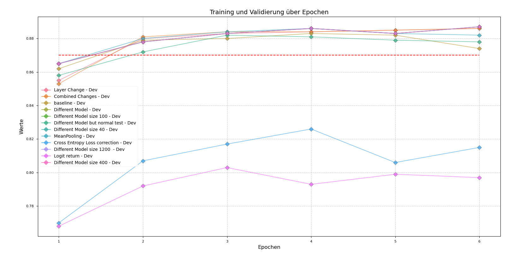

# DNLP SS25 Final Project 

<b> NiceLoveablePeople </b>  

Esther Hagenkort: esthako/GOESTERN-1006113  

Georg Eckardt: qub3s  

Hamza Ahmed Siddiqui: hamzasiddiqui10  

Amon Pönitzsch: 4m0n  

Leonardo Christian da Camara Silva: Dacasil  

  
## Introduction
This repository is our baseline implementation of the project for the model M.Inf.2202: Deep Learning for Natural Language Processing at the University of Göttingen by the GippLab.

Aditionally to completing the bert implementation and the optimizer, the following tasks have been completed:
- Stanford Sentiment Treebank (SST) - Sentiment analysis
- Quora Question Pairs (QQP) - Question similarity
- Semantic Textual Similarity (STS) - Measuring text meaning similarity
- Paraphrase Type Detection (PTD) - Identifying paraphrase types and relationships
- Paraphrase Type Generation (PTG) - Generating diverse paraphrase types
- bonus: Paraphrase Type Detection with Bert (PTD-Bert) - Identifying paraphrase types and relationships

## Implementation & Contribution
We followed the instructions and adapted hyperparameters when needed to avoid overfitting.

Esther Hagenkort: 
- bert.py (revise, comment)
- bonus: paraphrase type detection with bert (PTD-bert) (debugging)
- Paraphrase Type Generation (PTG)

Georg Eckardt: 
- optimizer
- bert.py
- paraphrase type detection

Hamza Ahmed Siddiqui:
- bert.py (revise, comment)
- Stanford Sentiment Treebank (SST) - Sentiment analysis

Amon Pönitzsch:
- paraphrase detection (QQP)

Leonardo Christian da Camara Silva:
- Semantic Textual Similarity (STS)
- bonus: paraphrase type detection with bert (PTD-bert)
  

## Results Part 1
For the baselines we reached the following results with the described hyperparameters and metrics.
We noticed that the results changed from run to run even if the hyperparameters were not changed. We therefore assume that something with the seed is not working.

### Stanford Sentiment Treebank (SST) - Sentiment analysis
**Hyperparameters:**
- mode: `finetune`

- epochs: `6`

- learning rate: `1e-05`

- optimizer: `AdamW`

- dropout rate: `0.25`

- batch size: `64`

- Accuracies Epoch 6: `train :: 0.896`, `dev :: 0.521`
- Best dev Accuracy: `train :: 0.704`, `dev :: 0.540` (Achieved in epoch 4)
The model finished training in the 6th epoch with a dev accuracy within 2 standard deviations of the baseline. The dev accuracy decreased after epoch 4 hinting at overfitting in training. We will tackle the overfitting problem with hyperparameter tuning in phase 2.

**Training results:**

### Quora Question Pairs (QQP) - Question similarity
**Hyperparameters:**
- mode: `finetune`

- epochs: `1`

- learning rate: `8e-5`

- optimizer: `AdamW`

- dropout rate: `0.1`

- batch size: `64`

**Training results:**
- Dev Accuracy Finetuning: `0.870`

### Semantic Textual Similarity (STS) - Measuring text meaning similarity
**Hyperparameters:**
- mode: `finetune`

- epochs: `10`

- learning rate: `1e-5`

- optimizer: `AdamW`

- dropout rate: `0.25`

- batch size: `64`

**Training results:**
- Dev Correlation STS Finetuning: `0.371`

### Paraphrase Type Detection (PTD) - Identifying paraphrase types and relationships
**Hyperparameters:**
- epochs: `10`

- learning rate: `1e-5`

- optimizer: `AdamW`

- dropout rate: `0.1`

- batch size: `64`

**Training results:**
- Paraphrase Detection: Dev Accuracy: `0.906`
### Paraphrase Type Generation (PTG) - Generating diverse paraphrase types

**Hyperparameters:**
- epochs: `5`

- learning rate: `1e-5`

- eps = `1e-8`

- optimizer: `AdamW`

- batch size: `32`
**Training results:**
- Paraphrase Generation: BLEU Score: `49.18`
  
### Bonus: Paraphrase Type Detection with Bert (PTD-bert) - Identifying paraphrase types and relationships

**Hyperparameters:**
- epochs: `10`

- learning rate: `1e-6`

- eps = `1e-8`

- optimizer: `AdamW`

- batch size: `16`
  
**Training results:**
  - Dev Accuracy `0.13`
  - Dev Macro f1 `0.264`
  - Dev Micro f1 `0.709`

**Evaluation structure:**
The ETPC train label distribution (mean label value per class): 
[0.138, 0.049, 0.048, 0.127, 0.179, 0.647, 0.109, 0.049, 0.001, 0.005, 0.198, 0.013, 0.041, 0.006, 0.017, 0.011, 0.112, 0.192, 0.018, 0.075, 0.764, 0.207, 0.092, 0.993, 0.164, 0.023]

It indicates that most classes are very rare (mean values close to 0.01-0.05) and a few classes are very common (e.g. class 23 with 0.993). So it follows that we have severe class imbalance, so its hard to learn rare classes and therefore the standard accuracy (fraction of correct labels) might be missleading. Thats why I decided to also display the macro and micro F1.

**Improvements:**
For the second part I will do hyperparameter finetuning to counter overfitting and find the best local minima. Also I will try to impliment the "Siamese + interaction" recipe used by DeBErta on ETPC from the GippLab group (Paraphrase Types for Generation and Detection, Wahle et al.) and other improvements from Chapter 7.

## Results Part 2

### Quora Question Pairs (QQP) - Question similarity

To continue with the Quora Question Pairs (QQP) project, my main goal was to surpass the initial baseline development accuracy of 0.870. For this part i made a few specific adjustments to the hyperparameters. The execution time for 6 epochs consistently remained at around 77 minutes (±1 min) across all runs, so this metric will not be a focus for further analysis.

I decided to increase the number of epochs to 6 and reduce the learning rate to 1e-5. My intention was to give the model more time to learn while taking smaller steps during the training process. This approach was successful, and my Hyperparamer-fine-tuned model achieved a new peak development accuracy of `0.883`. Although this wasn't the final, comprehensive set of changes, I decided to establish this as my new, personal baseline for the project. My next step will be to implement more significant modifications to try and improve on this new benchmark.

<h3>Multi-layer Perceptron Classifier for Paraphrase Detection</h3>

 

**Explanation**

The original model used a single linear layer to classify paraphrases, which is a simplistic approach. The improved version replaces this with a **multi-layered classifier** to learn more complex patterns. This change is based on the principle that a deeper network can capture more nuanced relationships between the sentence embeddings, leading to better performance. The addition of a **GELU activation function** and an extra dropout layer introduces non-linearity and helps prevent overfitting.

**Implementation**

The single `nn.Linear` layer for the `paraphrase_classifier` was replaced with a `nn.Sequential` block. This new architecture consists of two linear layers, a GELU activation, and a dropout layer. The first linear layer transforms the concatenated BERT embeddings (`BERT_HIDDEN_SIZE`) into a hidden size of 768, while the second layer outputs the final logit. To ensure stable training, the weights of both linear layers were initialized using **Xavier uniform initialization**, and their biases were set to zero.

**Results**

The implementation of the new classifier resulted in a modest improvement in performance, with the accuracy increasing from 0.870 to 0.886.

 

<h3>Paraphrase Detection: A Bi-Encoder Approach</h3>

 

**Explanation**

The previous model's approach to paraphrase detection was limited. It concatenated the input sentences and processed them as a single sequence, relying on the BERT model to create a single, combined embedding. This method may not be optimal for capturing the individual nuances of each sentence and their relationship.

The new implementation improves on this by treating the sentences separately. By generating individual embeddings for each sentence (u and v), the model can explicitly compare them. The core of this improvement is the **S.I.A.M.E.S.E. (Sentence-pair similarity)** approach, which uses three distinct features for classification:

1. The embedding of the first sentence (u).
2. The embedding of the second sentence (v).
3. The absolute difference between the two embeddings (∣u−v∣).

This triplet of features allows the model to learn a richer representation of the relationship between the sentences. It gives the model a more explicit signal about the magnitude of the differences between the two sentence vectors, which is a powerful indicator of their semantic similarity. This approach should lead to a **more robust and accurate model** for paraphrase detection.

**Implementation**

The `predict_paraphrase` function was modified to first get the individual embeddings for each sentence, `u` and `v`, by calling `self.forward` on `input_ids_1` and `input_ids_2` separately. Dropout was applied to each embedding to prevent overfitting.

After obtaining the individual embeddings, the absolute difference `abs_diff = torch.abs(u - v)` was calculated. Finally, the three feature vectors—`u`, `v`, and `abs_diff`—were concatenated along the last dimension to form `combined_features`. This combined vector was then passed to the `paraphrase_classifier`, which was updated in the `__init__` function to accept an input size of `BERT_HIDDEN_SIZE * 3` to match the new feature representation. The output of the classifier is a single logit, which is then used for the final binary classification.

**Results**

The implementation of the Siamese network with concatenated embeddings resulted in a decreased development accuracy, from a baseline of 0.883 to 0.803. This result is contrary to the expected improvement. A possible reason for this performance drop is the loss of contextual interaction between the two sentences that the original single-sequence approach provides. Although a Siamese network is generally effective, the direct concatenation and processing of both sentences by BERT in the baseline model might be capturing a crucial inter-sentence context that the separate-embedding approach misses. Additionally, the new, larger input to the classifier might be more difficult to train, and the model may have overfit on the training data, leading to a poorer generalization on the development set.

 
<h3>Improving Embeddings with Mean Pooling and Layer Normalization</h3>

 

**Explanation**

In the initial model, the `pooler_output` was used for generating sentence embeddings. However, this output isn't always the best representation for semantic tasks like question-pair matching. My goal was to create a more robust and semantically meaningful sentence embedding.

I decided to try **mean pooling** on the last hidden state of the BERT model. Unlike the `pooler_output`, which is essentially just the representation of the `[CLS]` token, mean pooling averages the embeddings of all tokens in a sentence. This approach should provide a more comprehensive representation of the entire sentence's meaning, which could lead to better performance on the Quora Question Pairs (QQP) task.

Additionally, I applied **Layer Normalization** to the embeddings. This technique helps to stabilize the training process and can improve model performance by ensuring that the inputs to the downstream layers have a consistent distribution. I hoped this would further enhance the quality of the embeddings.

**Implementation**

I implemented a new `mean_pooling` function that calculates the average of the `last_hidden_state` from the BERT model, using the `attention_mask` to correctly handle padded tokens. This ensures that only the actual words in a sentence contribute to the average. The function takes the `model_output` and `attention_mask` as input, performs an element-wise multiplication, sums the embeddings, and then divides by the sum of the mask to get the average.

In the `forward` pass, I added a condition to check if the task is "qqp." If it is, the new `mean_pooling` function is called to generate the embeddings. After mean pooling, I applied `nn.functional.layer_norm` to the resulting embeddings before returning them. For other tasks, the original `pooler_output` is still used.

**Results**

The implementation of mean pooling and Layer Normalization led to a noticeable improvement in model performance. The accuracy increased from 0.883 to 0.886. This shows that using a more sophisticated embedding strategy, which captures the semantic content of the entire sentence, is more effective for the Quora Question Pairs task. This change demonstrates that the quality of the sentence embeddings is a important factor in the success of the model.

 
<h3>Adding a Contrastive Loss to Improve Paraphrase Detection</h3>

 

**Explanation**

In our paraphrase detection task, the goal is for the model to learn that semantically similar questions should have similar embeddings. While the standard binary cross-entropy loss trains the model to classify question pairs as paraphrases or not, it does not explicitly enforce this semantic similarity in the embedding space. My idea was to add a contrastive loss to the training process. This loss function would encourage the embeddings of similar questions to be closer to each other, while pushing the embeddings of dissimilar questions farther apart. By adding this as a regularizer, the model should not only classify correctly but also learn a more meaningful and structured embedding space, which I hoped would lead to better performance.

**Implementaion**

I introduced a secondary loss term, the **contrastive loss**, to the training loop. First, I modified the `predict_paraphrase` method to return the sentence embeddings (`u` and `v`) in addition to the classification logits. The embeddings were then normalized. A similarity matrix was computed using the dot product of these normalized embeddings. The contrastive loss was calculated using cross-entropy, where the model was trained to identify the matching pairs in the similarity matrix. This new loss term was then added to the original binary cross-entropy loss for classification, with a small weight of 0.1 to act as a regularizer. The total loss was then used for backpropagation.

**Results** 

The new implementation resulted in a decrease in accuracy from 0.883 to 0.826. This was an unexpected outcome, as the goal was to improve the model's performance by adding a contrastive objective. A possible reason for this drop could be the low weight of the contrastive loss (0.1). This might not have been enough to effectively regularize the model, leading to a suboptimal balance between the two loss functions. It is also possible that the model struggled to learn both a good classification boundary and a well-structured embedding space simultaneously. A better approach might involve a different weighting of the contrastive loss or a more careful tuning of the temperature parameter, which was set to a fixed value of 0.05.

 
<h3>Layer Change</h3>

 

 

<h3>Summary of Experiments:</h3>

| Sno.| Experiment | Best Dev Accuracy |
|---|--------------|-------------------|
| 0 | Multi-layer Perceptron Classifier | 0.886 |
| 1 | Paraphrase Detection: A Bi-Encoder Approach | 0.803 |
| 2 | Mean Pooling and Layer Normalization | 0.886 |
| 3 | Contrastive Loss | 0.826 |
| 4 | Pre-training on an external dataset | 0.886 |
| 5 | Final Combined Model | 0.887 |

Introduction

The following figure visualizes the performance of the different model variants during training. Each graph illustrates how the development accuracy (Dev Accuracy) evolved over the epochs, allowing for a direct visual comparison of each architecture's performance.

Comparison of Model Performance During Training. This graph displays the development accuracy (Dev Accuracy), training accuracy (Train Accuracy), and training loss (Train Loss) for various model configurations over 6 epochs. Each line represents one of the tested architectures. The use of different markers (e.g., circles for development accuracy, triangles for training accuracy) helps distinguish between the metrics. The red dashed line indicates the initial baseline accuracy of 0.870.

### Grete Cluster
To run the tasks on the Grete cluster we adapted and used the `run_train.sh` script given to us.

## AI-Usage 
AI (debugging) support such as ChatGPT were used, a detailed AI-Usage card will be provided in the final report.

## Acknowledgement
The project description, partial implementation, and scripts were adapted from the default final project for the Stanford [CS 224N class](https://web.stanford.edu/class/cs224n/) developed by Gabriel Poesia, John, Hewitt, Amelie Byun, John Cho, and their (large) team (Thank you!)

The BERT implementation part of the project was adapted from the "minbert" assignment developed at Carnegie Mellon University's [CS11-711 Advanced NLP](http://phontron.com/class/anlp2021/index.html),
created by Shuyan Zhou, Zhengbao Jiang, Ritam Dutt, Brendon Boldt, Aditya Veerubhotla, and Graham Neubig  (Thank you!)

Parts of the code are from the [`transformers`](https://github.com/huggingface/transformers) library ([Apache License 2.0](./LICENSE)).

Parts of the scripts and code were altered by [Jan Philip Wahle](https://jpwahle.com/) and [Terry Ruas](https://terryruas.com/).

The project was modified by [Niklas Bauer](https://github.com/ItsNiklas/) for the 2025 DNLP course at the University of Göttingen.